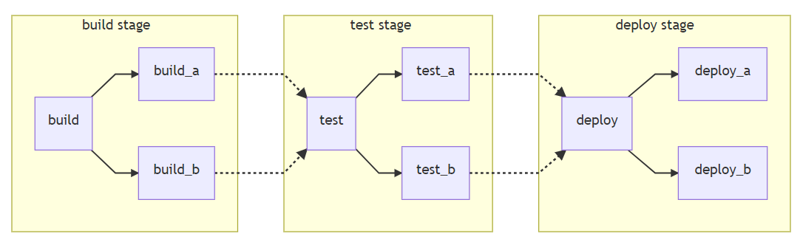
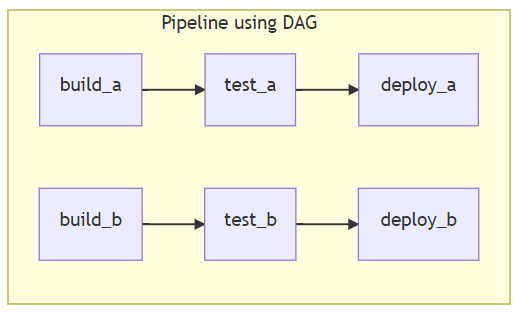

# Day 4- Hands-on on GitLab 

Today's day would be used for getting a glimpse of how GitLab helps us in implementing the CI/CD pipeline.

### <u>Introduction of GitLab:</u>

GitLab is a web-based DevOps tool that provides a Git-repository manager, letting developers collaborate, and built-in CI/CD feature. It is free for all and we do not need to install it separately. It provides integrated monitoring for servers as well as applications. While merging a branch, it determines the whole impact it parted on the production system.

### <u>GitLab CI/CD:</u>

GitLab is a built-in tool from GitLab, that takes us through different continuous methods like Continuous Integration(CI), Continuous Delivery(CD), Continuous Deployment.

GitLab is configured by using /.gitlab-ci.yml file. In this file we define whatever scripts including dependencies, commands, we want to run. 

GitLab identifies the script and runs with a tool, GitLab Runner. The script consists of various jobs that make up a pipeline.

Before going further, let's have a look at the fundamental building blocks of CI/CD in the pipeline- "Pipelines".

A basic pipeline has been depicted in the image below:



This is a basic pipeline where different stages(build, test, deploy) work concurrently in the same stage and then go to the other stage. A basic YAML file for a basic pipeline is as follows:

```yaml
stages:
  - build
  - test
  - deploy

image: alpine

build_a:
  stage: build
  script:
    - echo "Build 1 for build stage."

build_b:
  stage: build
  script:
    - echo "Build 2 for build stage."

test_a:
  stage: test
  script:
    - echo "Test 1 after build stage."
    - echo "Runs all tests concurrently after build stage."

test_b:
  stage: test
  script:
    - echo "Test 2"
    - echo "Runs all tests concurrently after build stage."

deploy_a:
  stage: deploy
  script:
    - echo "Deploy 1. "
    - echo "Will only run when all jobs in the test stage complete."

deploy_b:
  stage: deploy
  script:
    - echo "Deploy 2. "
    - echo "Will only run when all jobs in the test stage complete."
```

To make things more efficient and faster, we can another type of pipelines known as "Directed Acyclic Graph Pipelines."

In these pipelines, the "needs" keyword is used to show the dependencies between different stages making things works faster.



Yaml code for the DAG pipeline is as follows:

```yaml
stages:
  - build
  - test
  - deploy

image: alpine

build_a:
  stage: build
  script:
    - echo "Build 1 for build stage."

build_b:
  stage: build
  script:
    - echo "Build 2 for build stage."

test_a:
  stage: test
  needs: build_a
  script:
    - echo "Test 1 after build stage."
    - echo "Runs all tests concurrently after build stage."

test_b:
  stage: test
  needs: build_b
  script:
    - echo "Test 2"
    - echo "Runs all tests concurrently after build stage."

deploy_a:
  stage: deploy
  needs: test_a
  script:
    - echo "Deploy 1. "
    - echo "Will only run when all jobs in the test stage complete."

deploy_b:
  stage: deploy
  needs: test_b
  script:
    - echo "Deploy 2. "
    - echo "Will only run when all jobs in the test stage complete."
```

### <u>Basic Workflow:</u>

The moment a commit is pushed in the feature branch, the GitLab CI/CD pipeline is triggered. The following things are put into action:

1) Automated scripts are run that builds and tests our application.

2) Reviews the changes per merge.

Once all this is done, we can review our code, and merge the feature into the default or master branch.

* The CICD pipeline automatically deploys the changes done into the production environment.

Also, if anything goes wrong, we can easily rollback our changes.

A detailed workflow of the complete workflow has been shown in the picture.


### <u>Hands-on:</u>

1) First of all we need to log in to our GitLab account and hit create new repository option.

2) Say the name of the repository is "pipeline1".

3) Then we create a .gitlab-ci.yml file that would contain our script consisting of all the commands we want to run. For the time being, a very simple script is written:

```yaml
stages:
    - build
    - test
build:
    stage: build
    script:
        - echo "Build running"
        - mkdir "build_directory"
        - touch build_directory/buildfile.txt
test:
    stage: test
    script:
        - echo "Test running"
        - test -f "build_directory/buildfile.txt"

```

The above script first tells about the stages that would be present in our pipeline, which are 2 stages namely- "build" stage and "test", stage. 

Next we define script for each stage with the tasks that have to be performed within them. 

The build stage simply displays a message which is "Build running" followed with creating a directory and thereafter, creating a file named "buildfile.txt".

In the test stage we simply check whether the file is made or not.

Once we are ready with the yaml file, we can check for the validation of the file.

.png)

Now when we run the file, the pipeline starts:

.png)

The build passes, but the test stage fails. The pipeline is shown on the display:

.png)

The build failed because of the reason that as soon as the build stage it completed, the file made in it is also thrown away or it gets removed. Therefore to resolve this issue, the concept of making artifacts is used so that the first job creates an artifacts and informs the next job in between to access those artifacts. 

Therefore, we change the script to the following adding the artifacts field and showing the paths to the folder where our file exits.

```yaml
stages:
    - build
    - test
build:
    stage: build
    script:
        - echo "Build running"
        - mkdir "build_directory"
        - touch build_directory/buildfile.txt
    artifacts:
        paths:
            - build_directory/
test:
    stage: test
    script:
        - echo "Test running"
        - test -f "build_directory/buildfile.txt"

```

The file runs successfully passing all the stages without failure.

)

)

#### <u>Links referred:</u>

1. "https://www.youtube.com/watch?v=Jav4vbUrqII&t=232s"
2. "https://docs.gitlab.com/ee/ci/"
3. "https://docs.gitlab.com/ee/ci/introduction/index.html#basic-cicd-workflow"
4. "https://about.gitlab.com/blog/2019/09/26/building-a-cicd-pipeline-in-20-mins/"

"https://docs.gitlab.com/ee/ci/"

