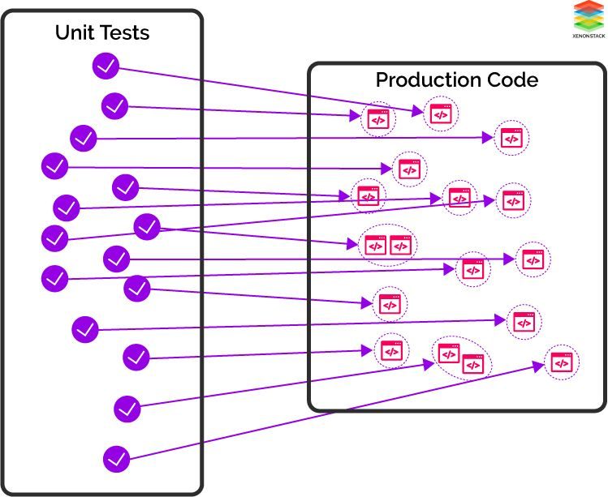
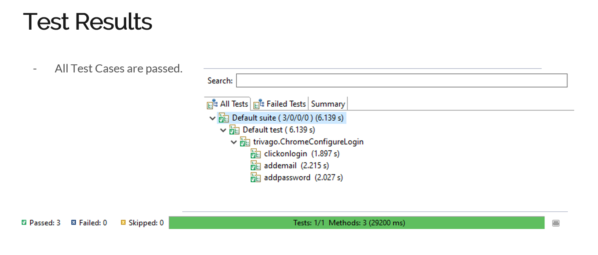

# Day 6- Learning about various Unit Testing tools

#### <u>Introduction:</u>

Unit testing is testing smaller units or modules of the source code, to ensure that the code functions as designed without showing any unexpected behavior.

It can be performed for functions, procedures, or methods for Procedural as well as Object-Oriented Programming.

This improves code quality, required time required for testing, and also decreases cost.



A testing tool should be chosen wisely according to the requirements and the following points:

1) The tool should have a minimum implementation time. This is only possible when the user is familiar with the testing tool or the tool should have proper documentation and support available to use it.

2) The costs should be minimum if the tool is commercial. An open-source tool would be less efficient and limited features.

3) The tool should be flexible as every project has its requirements, and is different. Therefore, the code modification feature should be there in the tool.

There are multiple tools for different languages out of which some of them are discussed below<u>:</u>

###### 1) <u>JUnit:</u> 

- This is a testing framework used for Java programming language. 
- A simple framework to write repeating tests.
- It has many features including assertions for checking the expected output of the test cases accordingly, test runners for running the test cases.
- A test case has been shown implementing the JUnit framework.

Implementing JUnit:

The first step is to download the junit jar files.

Then we write a simple java function inside a class and then make a test case using @Test annotation.

The test case output has been shown below:

.png)

###### <u>2) TestNG:</u>

* Testing framework for Java, inspired by JUnit and NUnit.
* Includes support for data driven testing, annotation, and integration with Selenium.
* It is designed in such a way that it can cover all categories of testing such as unit, functional, integration.
* Can also be run by Ant via build.xml, or n IDE plugin, providing flexibility.

In the image below, TestNG has been used to test Trivago website:



Code for the above is as follows:

```java
package trivago;

import org.testng.Assert;
import org.testng.annotations.*;

import java.util.List;

import org.openqa.selenium.By;
import org.openqa.selenium.WebDriver;
import org.openqa.selenium.WebElement;
import org.openqa.selenium.chrome.ChromeDriver;

public class ChromeConfigureLogin {
	
WebDriver obj;
	
	@BeforeTest
	void configure(){
		String url="https://www.trivago.in/";
		System.setProperty("webdriver.chrome.driver", "C:\\Selenium Softwares\\chromedriver.exe");
		obj=new ChromeDriver();
		obj.manage().window().maximize();
		obj.get(url);
	}
	@Test (priority=0)
	void clickonlogin()
	{
		WebElement element;
		element=obj.findElement(By.xpath("//*[@id=\"js_navigation\"]/div/div[1]/button"));
		String name=element.getText();
		Assert.assertTrue(name.contains("Log in"));
		element.click();
	}
	@Test (priority=1)
	void addemail()
	{
		WebElement element,element1;
		element=obj.findElement(By.xpath("//*[@id=\"check_email\"]"));
		element.sendKeys("prajjawalbanati16@gmail.com");
		element1=obj.findElement(By.xpath("//*[@id=\"login_email_submit\"]"));
		element1.click();
		try 
		{
			Thread.sleep(2000);
		}
		catch(Exception ex)
		{
			ex.printStackTrace();
		}
	}
	@Test (priority=2)
	void addpassword()
	{
		WebElement element,element1;
		element=obj.findElement(By.xpath("//*[@id=\"login_password\"]"));
		element.sendKeys("u6y2IO@1");
		element1=obj.findElement(By.xpath("//*[@id=\"login_submit\"]/span[1]"));
		element1.click();
		
	}
	@AfterTest
	void closebrowser()
	{
		obj.quit();
	}

}

```


Different annotations has been used such as @AfterTest, @BeforeTest, @Test. Also we can add priorities.

Similar to these, there are many unit testing tools available according to the requirements. 

### <u>About Cloud native</u>:

Cloud native is basically an approach to design, build, and run applications. To do that, we require:

* Continuous integration, building a pipeline to automate the process via tools like Jenkins, TeamCity 
* Container engines like Docker, and 
* Orchestrators like Kubernetes.

This improves time to delivery, scalability, and management cost. 

#### <u>Deployment Platforms, Infrastructure, Continuous Delivery of Java Apps</u>

###### A platform performs the following functionality:

* Securities by restricting ports, strong authentication before accessing any control panels.
* Location for any third-party application or additional services.
* Storage
* Java runtime
* Location ( virtual or physical) for hosting the application accessible to users.


### <u>Links referred:</u>

1. "https://www.softwaretestinghelp.com/unit-testing-tools/"
2. "https://www.invensis.net/blog/it/best-automated-unit-testing-tools-features/"
3. "https://www.redhat.com/en/resources/cloud-native-container-design-whitepaper"
4. "https://www.oreilly.com/library/view/continuous-delivery-in/9781491986011/ch04.html"
5.  "https://www.youtube.com/watch?v=NoFu_rpM7EQ"
